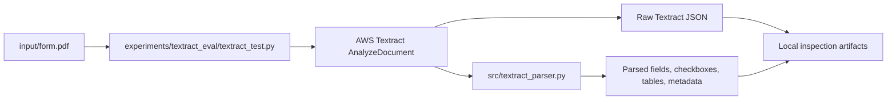

# Textract Architecture

## Scope

This repository is currently running Textract as an isolated experiment.
The EasyOCR pipeline, frontend contracts, and deployment flow remain unchanged.

The experiment path is:

## Current MVP Flow

1. Render a representative local PDF page to PNG bytes.
2. Call `AnalyzeDocument` with `FORMS` and `TABLES` enabled.
3. Save the raw Textract response locally.
4. Parse the block graph into a normalized structure.
5. Print a readable summary for manual inspection.

## Experimental Outputs

The isolated runner writes artifacts under `experiments/textract_eval/output/`.
The main files are:

- raw Textract JSON per page
- parsed JSON per page
- combined summary JSON for the sample PDF

## Design Notes

Textract is treated as a document understanding service rather than a drop-in OCR replacement.
That means the first useful unit is the response graph, not a flat line list.

The parser is intentionally separate from the production OCR path so the team can study response structure before deciding how much of the pipeline should move to Textract.

## Differences From EasyOCR

- EasyOCR produces normalized text items; Textract produces a block graph.
- EasyOCR is image-first; Textract exposes structure first and text second.
- Textract can represent tables, form fields, and checkbox state directly.
- The parser must rebuild semantics from relationships rather than heuristics alone.

## Future Direction

If this MVP proves useful, the next step would be to decide whether the Textract path should remain synchronous for small documents or move to an async S3/Lambda workflow for larger inputs.
That decision is intentionally deferred for this phase.