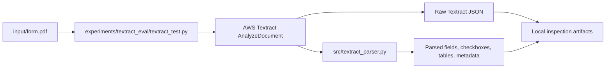

# Textract Architecture

## Scope

This repository is currently running Textract as an isolated experiment.
The EasyOCR pipeline, frontend contracts, and deployment flow remain unchanged.

The experiment path is:



## Current MVP Flow

1. Render a representative local PDF page to PNG bytes.
2. Call `AnalyzeDocument` with `FORMS` and `TABLES` enabled.
3. Save the raw Textract response locally.
4. Parse the block graph into a normalized structure.
5. Print a readable summary for manual inspection.

## Experimental Outputs

The isolated runner writes artifacts under `experiments/textract_eval/output/`.
The main files are:

- raw Textract JSON per page
- parsed JSON per page
- combined summary JSON for the sample PDF

## Design Notes

Textract is treated as a document understanding service rather than a drop-in OCR replacement.
That means the first useful unit is the response graph, not a flat line list.

The parser is intentionally separate from the production OCR path so the team can study response structure before deciding how much of the pipeline should move to Textract.

## Differences From EasyOCR

- EasyOCR produces normalized text items; Textract produces a block graph.
- EasyOCR is image-first; Textract exposes structure first and text second.
- Textract can represent tables, form fields, and checkbox state directly.
- The parser must rebuild semantics from relationships rather than heuristics alone.

---

# Phase 2 — Modular Architecture Preparation

## Current Modular Structure

### Service Layer (`src/textract_service.py`)
- Lightweight wrapper around Textract response parsing
- Exports: `parse_response_file()`, `load_json()`, `save_json()`
- Separates file I/O from parsing logic
- **Serverless readiness**: Can be easily adapted to accept S3 URLs or stream inputs

### Parser Layer (`src/textract_parser.py`)
Core document intelligence transformation:
- **Main export**: `parse_textract_response()` — converts raw AWS responses to structured format
- **Extraction functions**:
  - `_extract_key_value_items()` — field extraction with multiline support
  - `_extract_tables()` — table reconstruction with normalization
  - `_extract_checkboxes()` — checkbox detection with advanced ownership mapping
  - `_find_owning_key_for_checkbox()` — 4-strategy ownership resolution (VALUE→KEY, cell context, parent KEY_VALUE_SET, unassociated)
- **Features**:
  - Multiline field handling with line break preservation
  - Geometry normalization (bbox, polygon standardization)
  - Page-aware grouping (fields/tables/checkboxes per page)
  - Confidence aggregation and summarization
  - Table row normalization with header detection
- **Output schema** (backward-compatible):
  ```json
  {
    "fields": {},
    "field_items": [],
    "checkboxes": [],
    "tables": [],
    "pages": [],
    "metadata": {},
    "confidence_summary": {}
  }
  ```

### Validation Layer (`src/textract_validators.py`)
Modular, pure-function validators for data quality:
- `normalize_table_for_export()` — normalize tables, detect headers, fill sparse cells
- `validate_checkbox_ownership()` — validate checkbox-to-field mapping with confidence ratings
- `summarize_table_extraction()` — table statistics and coverage metrics
- `summarize_checkbox_extraction()` — checkbox selection rates and ownership breakdown
- `compare_field_and_checkbox_consistency()` — cross-field validation and overlap analysis
- **Serverless readiness**: Pure functions, no I/O, suitable for Lambda post-processing

### Evaluation Framework (`experiments/textract_eval/`)
- **Manifest-driven**: `manifest.json` lists documents for evaluation
- **Run**: `python experiments/textract_eval/run_eval.py`
- **Generates per-document**:
  - Parsed output (`{id}.parsed.json`)
  - Table validation report (`{id}.tables.json`)
  - Checkbox validation report (`{id}.checkboxes.json`)
  - Consistency analysis (`{id}.consistency.json`)
  - Comparison summary (`{id}.comparison.json`)
- **Output**: Summary report (`outputs/summary.json`) with cross-document metrics

## Migration Pathway to Serverless

### Current State (Phase 1)
```
PDF → Textract API → raw_response.json → Parser → Structured Output
```

### Next: Lambda Architecture (Phase 2-3)
```
S3 Upload Trigger
    ↓
Lambda: Validate Input Format
    ↓
Call Textract StartDocumentAnalysis / AnalyzeDocument
    ↓
SNS: Job Complete Notification
    ↓
Lambda: Parse & Validate (src/textract_service + src/textract_parser + src/textract_validators)
    ↓
S3: Store Structured Output + Validation Reports
    ↓
API Gateway: Expose Results & Metrics
    ↓
DynamoDB: Track Document Processing State
```

## Design Principles

1. **Modularity**: Each layer (service, parser, validation) is independent and testable
2. **Purity**: Validators are pure functions with no side effects or external dependencies
3. **Determinism**: All operations are idempotent and reproducible
4. **Backward Compatibility**: Parser output extends existing fields without breaking changes
5. **Observability**: Confidence scores, metadata, and ownership strategies included in all outputs
6. **Fail-Safe**: Validation functions degrade gracefully on missing/malformed data

## Integration Points

### With Existing Pipeline (`src/ocr.py`, `src/mapping.py`)
- **No breaking changes**: New Textract layer runs independently
- **Future**: Create `src/document_orchestrator.py` to choose Textract vs OCR per document type
- **Parallel**: Both pipelines can run side-by-side for benchmarking

### With Frontend
- Parser output schema is frontend-friendly with structured `fields`, `tables`, `checkboxes`
- Confidence scores enable UI to highlight uncertainty
- Geometry data (bounding boxes) enables PDF overlay visualization
- Page grouping supports multi-page document navigation

### With Deployment
- No changes to Docker, deployment flows, or frontend hosting
- All Textract logic isolated to `feature/textract-architecture` branch
- Ready to merge post-evaluation

## Performance Characteristics

- **Parser**: ~10-50ms for typical form (varies by page count and complexity)
- **Validators**: ~1-5ms overhead for comprehensive checks
- **Memory**: Entire parsed output typically < 5MB for multi-page documents
- **API calls**: Textract charges per page; recommend batching for cost optimization

## Future Direction

If this MVP proves useful, the next step would be to decide whether the Textract path should remain synchronous for small documents or move to an async S3/Lambda workflow for larger inputs.
That decision is intentionally deferred for this phase.