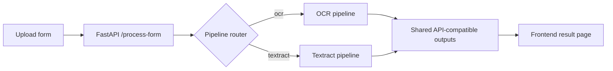
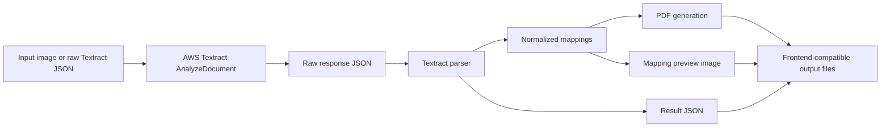

# Textract vs OCR Architecture Report

## Purpose

This repository now contains two independent document-intelligence architectures:

- the stable OCR pipeline based on EasyOCR, OpenCV, and heuristic mapping
- the experimental Textract pipeline based on AWS Textract AnalyzeDocument

The goal of this report is to explain how the architectures are separated, how the Textract algorithm works, and how PDF generation happens after extraction.

## 1. Architecture Separation

The two systems are intentionally separated so that the experimental Textract work never silently changes production OCR behavior.

### 1.1 Control Plane

Routing is handled by `src/pipelines/pipeline_router.py`.

The selected pipeline is determined from the environment variable `FORM_PARSER_PIPELINE_MODE`:

- `ocr` means use the existing OCR pipeline
- `textract` means use the Textract pipeline
- `hybrid` is reserved for future work and currently falls back to OCR

If the value is missing or invalid, the router safely falls back to OCR.

### 1.2 Separation Boundaries

The separation is not just conceptual. It is enforced in code:

- `src/pipelines/ocr_pipeline.py` wraps the existing OCR workflow without changing extraction logic
- `src/pipelines/textract_pipeline.py` isolates the Textract path from OCR internals
- `src/pipelines/pipeline_router.py` chooses which wrapper runs
- `src/api.py` stays contract-compatible and only consumes the router output
- the frontend remains intelligence-agnostic and only receives file URLs plus summary metadata

### 1.3 Why This Separation Matters

This design gives us:

- deterministic debugging, because logs show which pipeline ran
- reliable benchmarking, because OCR and Textract outputs are not mixed implicitly
- safe rollback, because OCR remains the default execution path
- local experimentation, because Textract can be turned on with a single env change

### 1.4 High-Level Flow



## 2. Textract Algorithm in Detail

Textract is used as a block-graph document understanding system, not as a flat OCR replacement.

### 2.1 Input Stage

The Textract pipeline accepts either:

- a local image path, or
- a raw Textract JSON response for offline testing

For live use, the image bytes are sent to AWS Textract using `AnalyzeDocument` with:

- `FORMS`
- `TABLES`

The pipeline stores the raw AWS response before parsing so the experiment is reproducible.

### 2.2 Response Graph Preparation

`src/textract_parser.py` first builds a block lookup table:

- `blocks_by_id` maps each Textract block ID to the raw block
- `parent_map` maps child block IDs back to parent block IDs
- text caching avoids recomputing nested block text repeatedly

This is important because Textract emits a graph of relationships, not a ready-made table of fields.

### 2.3 Field Extraction Algorithm

Field extraction uses the `KEY_VALUE_SET` blocks.

The parser:

1. finds all blocks of type `KEY_VALUE_SET`
2. keeps only blocks tagged as `KEY`
3. resolves the key text by recursively reading child blocks
4. follows `VALUE` relationships to get the value side
5. stores a structured field item with key, value, confidence, page, and geometry

If multiple value blocks exist for one key, the parser joins them in a normalized form.

### 2.4 Multiline Handling

Multiline fields are one of the places where Textract is stronger than simple OCR, but only if the parser preserves structure.

The parser detects `LINE` children and keeps line breaks instead of flattening everything into one space-separated string.

This matters for:

- addresses
- notes
- multi-line names
- wrapped label/value pairs

### 2.5 Checkbox Extraction Algorithm

Checkbox handling uses `SELECTION_ELEMENT` blocks.

Each checkbox is converted into a structured entry with:

- selection state
- confidence
- page number
- geometry
- parent block IDs
- ownership metadata

Ownership is resolved through a fallback chain:

1. direct VALUE→KEY relationship, if available
2. table-cell context, if the checkbox lives inside a table cell
3. parent `KEY_VALUE_SET` key association
4. unassociated fallback when no ownership clue exists

That ownership logic is what makes checkbox parsing practical for evaluation, because raw Textract checkboxes alone do not always tell you which label they belong to.

### 2.6 Table Reconstruction Algorithm

Tables are rebuilt from `TABLE` and `CELL` blocks.

For each table:

1. the parser collects all child `CELL` blocks
2. row and column indexes are read from each cell
3. the maximum row and column dimensions are computed
4. a grid is allocated
5. each cell text is inserted into the proper row/column position
6. the row data is normalized so blank cells become `None`

This gives both a sparse grid and a detailed cell list, which is useful because Textract tables can have irregular shapes, merged cells, or partial structure.

### 2.7 Geometry Normalization

Textract geometry arrives in normalized coordinates.

The parser standardizes the geometry into a consistent schema:

- bounding boxes with `Left`, `Top`, `Width`, `Height`
- polygons as ordered `X`, `Y` points

This keeps downstream rendering and comparison stable.

### 2.8 Confidence Aggregation

The parser also produces a confidence summary across:

- key-value items
- tables
- checkboxes
- words and lines

That summary is used for evaluation and local debugging, not for changing the extraction result automatically.

### 2.9 Structured Output

The parsed output is normalized into a frontend-friendly schema:

```json
{
  "fields": {},
  "field_items": [],
  "checkboxes": [],
  "tables": [],
  "pages": [],
  "metadata": {},
  "confidence_summary": {}
}
```

## 3. Textract Pipeline Flow

`src/pipelines/textract_pipeline.py` turns the parsed Textract output into the same downstream artifacts the UI already expects.

### 3.1 Runtime Flow



### 3.2 What the Pipeline Writes

The Textract wrapper writes these artifacts into the run directory:

- `textract_raw_response.json`
- `textract_parsed.json`
- `mappings.json`
- `result.json`
- `mapping.png`
- `output.pdf`
- `mapping_diagnostics.json`
- `benchmark_summary.json`

### 3.3 Why Result Compatibility Matters

The frontend already knows how to consume:

- `pdf_url`
- `mapping_preview`
- `result_url`
- `stats.mapping_count`

So the Textract pipeline must return the same type of response envelope as the OCR pipeline.

That is why the router and Textract wrapper normalize their outputs instead of asking the frontend to understand Textract-specific details.

## 4. PDF Generation Flow

PDF generation is the last stage of the pipeline and is shared conceptually across both architectures.

The current implementation uses `src/pdf_generator.py`.

### 4.1 Inputs to PDF Generation

The PDF generator receives:

- the source image path
- the list of extracted mappings
- the output PDF path

Each mapping may contain one or more field boxes.

### 4.2 PDF Generation Steps

1. load the source image using ReportLab’s `ImageReader`
2. read the source image dimensions
3. compute scale factors from image pixels to PDF page size
4. draw the source image as the PDF background
5. iterate over mappings
6. validate each mapping and its box coordinates
7. create either a text field or checkbox control
8. save the PDF to disk

### 4.3 Coordinate Translation

The important transformation is pixel-to-PDF scaling.

The image is stretched to fit the PDF page, so each box coordinate is scaled before it is used to create an AcroForm field.

In practice:

- `x` and `width` are scaled horizontally
- `y` is inverted because PDF coordinates are bottom-up
- `height` is scaled vertically

This keeps the interactive controls aligned with the source form image.

### 4.4 Field Type Handling

The generator chooses control type based on the mapping:

- `checkbox` mappings create PDF checkboxes
- all other mappings create underlined text fields

That behavior makes the output usable as a fillable form, not just a visual overlay.

### 4.5 Output Validation

After saving, the generator verifies that the file exists and is non-empty.

That check is important because PDF generation failures can otherwise look like a successful run until the frontend tries to open the file.

## 5. End-to-End Local Testing Flow

The local workflow for testing Textract through the frontend is:

1. set `FORM_PARSER_PIPELINE_MODE=textract`
2. start the backend with Uvicorn
3. set `NEXT_PUBLIC_API_BASE_URL=http://localhost:8000` in the frontend
4. start the Next.js dev server
5. upload a PDF through the existing frontend UI
6. verify the result page renders the generated PDF and mappings

For local browser testing, localhost CORS must also allow the frontend origin.

## 6. Key Takeaways

- OCR and Textract are now cleanly separated by a router rather than mixed implicitly.
- The Textract path works by reconstructing meaning from the Textract block graph.
- Checkbox and table handling are the main algorithmic value-adds of the Textract parser.
- PDF generation is still handled by the same downstream form-building flow, which preserves frontend compatibility.
- The frontend stays unchanged because the backend continues to return the same file URLs and response shape.

## 7. Summary

The repository now has a controlled architecture:

- OCR remains the stable default.
- Textract is isolated, observable, and reversible.
- Both paths produce compatible backend outputs.
- The frontend can be used locally for real end-to-end evaluation without any intelligence-specific changes.
